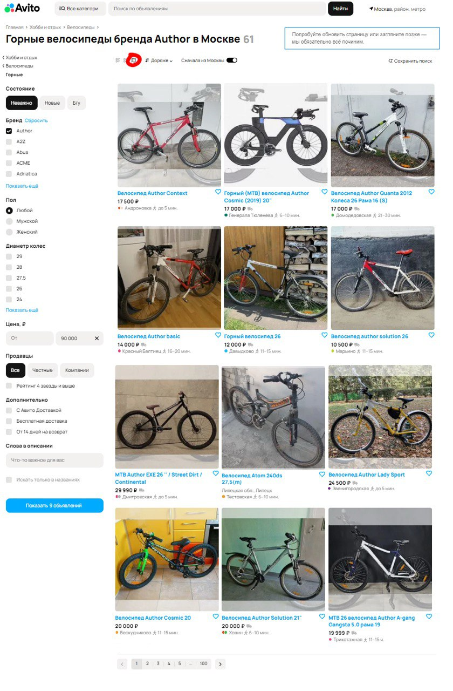
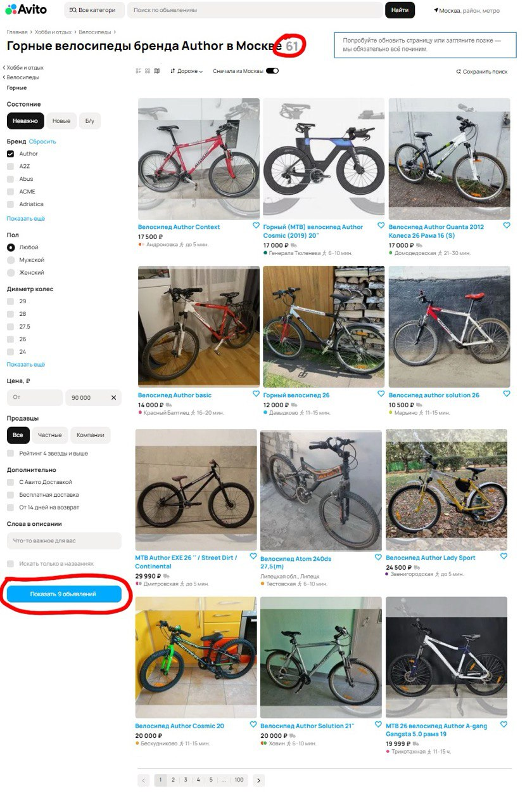
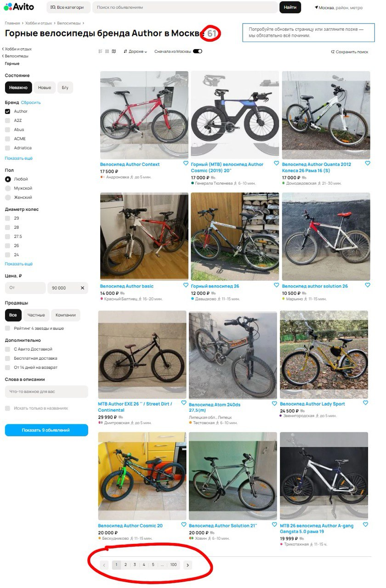
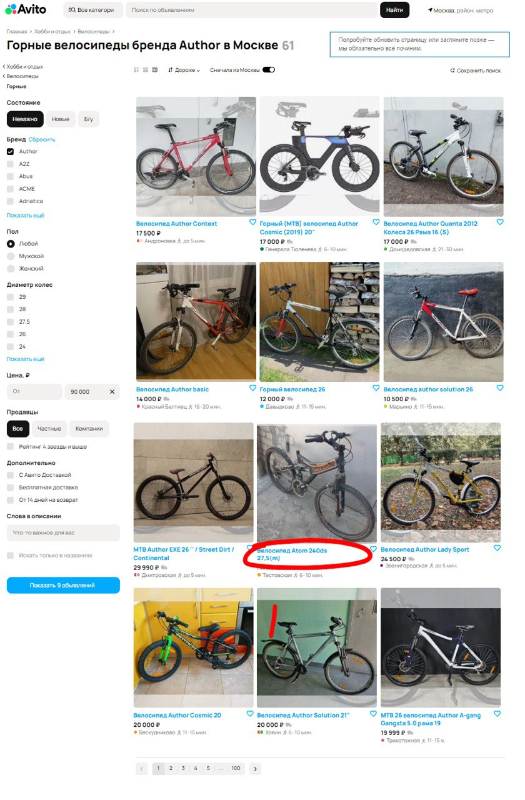
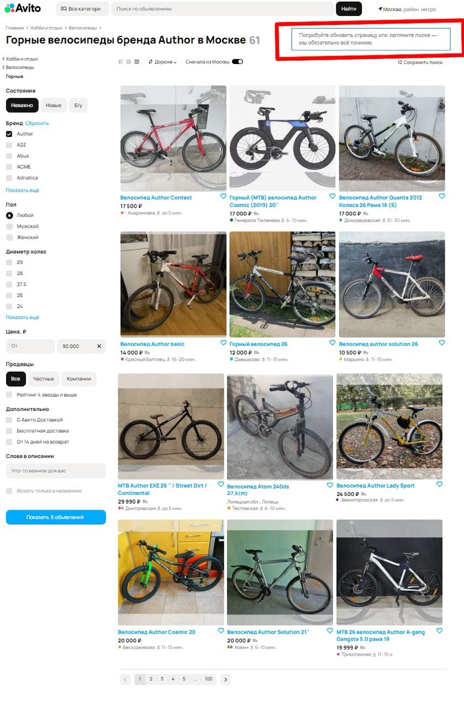

# Отчет о багах

## Баг 1: Не работает сортировка цены по возрастанию

**Приоритет:** Средний

**Описание:** Сортировка объявлений по возрастанию цены не работает на странице поиска.  

**Ожидаемый результат:** Объявления отсортированы по цене от большей к меньшей, так как выбран режим "Дороже".  

**Фактический результат:** Сортировка не применяется, на скриншоте мы видим, что цены не отсортированы по убыванию, обвёден пример.

**Скриншот:**  

## Баг 2: Вместо режима отображения объявлений на карте, включается режим отоброжения объявлений в виде сетки 

**Приоритет:** Средний

**Описание:** Отображение объявлений на карте выбрано пользователем, но объявления показываются в режиме сетки 

**Ожидаемый результат:** Объявления будт показаны на карте, так как выбран соответствующий режим.  

**Фактический результат:** Нужный режим не включается, объявления отображаются в виде сетки.
**Скриншот:**  

## Баг 3: Неправильно считается количество объявлений после применения фильтра

**Приоритет:** Средний

**Описание:** Вверху страницы мы видим, что всего по запросу найдено 61 объявление, но слева при указании параметра "Цена до 90.000" фильтр показывает, что всего будет найдено 9 объявлений,
что уже не так (как минимум, на первой странице продемонстированно 10 объявлений с велоспиедом Author, удовлетворяющих условию фильтра). (Можно было предположить, что фильтр уже применен, но чсило всё равно не сходится)

**Ожидаемый результат:** В фильтре отображается корректное число товаров, подошедших под его услвоия.

**Фактический результат:** После фильтрации остается меньше объявлений, чем должно быть, по крайней мере так нам сообщает счётчик в кнопке "Показать N объявлений"  
  

## Баг 4: Не отображается подкатегория объявлений под хиддером 

**Приоритет:** Низкий

**Описание:** Слева мы можем увидеть, что мы находимся в категории >Хобби и отдых >Велосипеды > Горные, но под хиддером страницы ситуация другая.  

**Ожидаемый результат:** Под хиддером отображается текущая подкатегория "Горные" (>Хобби и отдых >Велосипеды > Горные).  

**Фактический результат:** Отображается только подкатегория "Велосипеды", происходит несогласованность  

**Скриншот:**  

## Баг 5: Некорректно отображается паггинация страницы

**Приоритет:** Низкий

**Описание:** На самом верху страницы мы видим, что нашлось 61 одно объявление по нашему запросу, в конце страницы мы можем увидеть,
что сайт готов нам показать как минимум 100 страниц с объявлениями, применив немного математики и поделив количество объявлений на размерность сетки
(сетка, как видно, на 12 объявлений) мы получим немного отличающийся результат

**Ожидаемый результат:** Паггинация работает корректно, мы видим возможность выбрать примерно 5-6 страниц с объявлениями  
**Фактический результат:** Пагинация предлагает нам выбор аж до сотой страницы (что будет на сотой странице, вопрос интересный)

**Скриншот:**  

## Баг 6: Нет надписи "Цена не указана" у объявления

**Приоритет:** Низкий

**Описание:** У одного из объявлений есть только его название и никакой информации о цене товара  

**Ожидаемый результат:** В таких ситуациях должна появляться надпись "Цена не указана" (если цена не указана продавцом), "Бесплатно" (если продавец очень щедрый) или же непосредственно цена (если это стандартное объявление)

**Фактический результат:** Отображается только заголовок объявление, нет ни одной из надписей, связанных с ценой.

**Скриншот:**  

## Баг 7: Сообщение о сбое на странице объявлений

**Приоритет:** Высокий (допустим, высокий приоритет, но нужно выяснять причину, а не репортить плашку)

**Описание:** На странице отображается сообщение об ошибке 

**Ожидаемый результат:** На странице нет сообщения о сбое, либо мы сталкиваемся с явным багом, вызывающим этот сбой и видим эту плашку

**Фактический результат:** На странице отображается сообщение об ошибке, хотя явных причин этому нет

**Скриншот:**  

**UPD:** Вроде как, примено всё, что я смог увидеть (по крайней мере сейчас, что-то вероятно упустил). Решил не указывать как баг отсутствие некоторых вещей. Например, обычно слева отображается раздел "Часто ищут" с похожими объявлениями, 
да и параметров подбора в фильтре должно быть наверное чуть больше, но считаю, что это ненастолько критично, чтобы оформлять как проблему (каюсь, поленился немного)
